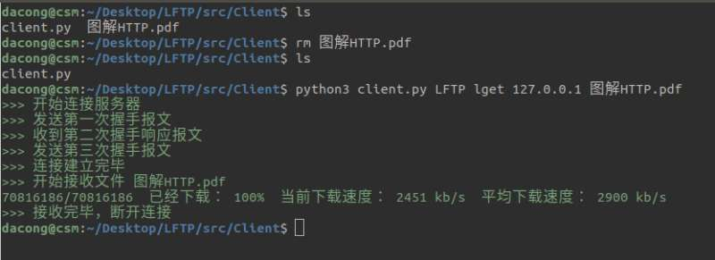

# LFTP Test

测试文档

---

## 局域网下进行测试

### 服务端
命令行开启服务(默认跑在123456端口)

```bash
$ python3 server.py
```


### 客户端
**命令错误会有相应的提示信息**


**发送数据**
使用指令`LFTP lsend 127.0.0.1 filepath` 进行上传相应的文件

这里我上传了一个几十MB的pdf文件：


上传结束：


对比服务端和客户端的文件大小：


可以发现客户端和服务端的文件子节数相同，上传成功


**接收数据**
使用指令`LFTP lget 127.0.0.1 filepath` 进行上传相应的文件

这里我删除刚才上传的了的pdf文件， 再进行下载：


下载结束：



对比服务端和客户端的文件大小：


可以发现客户端和服务端的文件子节数相同，下载成功

**测试并行下载**


上图可以看出服务端支持两个客户端同时进行文件的下载

**大文件下载**


**拥塞控制**

局域网下带宽过大，难以进行测量


